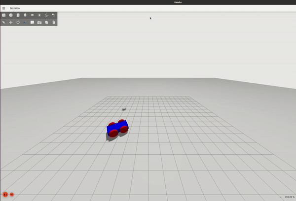

# NOTE : This repo is in a buiding phase and is just for representation as of now

# RL-moving-robot

This project mainly aims at using Reinforcement learning for  optimising the control of a simulated moving robot with addition gaussian noise applied to the system. 


## Overview 



<p align="center">
  <a href="http://wiki.ros.org/noetic#ROS_Noetic_Ninjemys">
    
  </a>
  <a href="https://gazebosim.org">
    
  </a>
  <br>
  <a href="https://www.gymlibrary.dev/">
    
  </a>
  <a href="https://stable-baselines3.readthedocs.io">
    
  </a>
</p>
 
This repository contains an RL Environmet `"moving-robot-v0"` with 2 continuous action spaces (linear and angular Twist messages) in cartesian space. The Observation of the environmet are position values of the model received through the scenario backend.   

The RL algorithms used are model free algorithms such as A2C, PPO and SAC.

## Instructions

Please make sure to encapsulate the repo inside a virtual environment, either [conda](https://docs.conda.io/en/latest/miniconda.html) or [virtualenv](https://virtualenv.pypa.io/en/latest/).  The current setup is tested in such a way that ignition gazebo and ROS is installed outside the conda environment. 

### Installation 

#### Hardware Requirements

- **CUDA GPU –** CUDA-enabled GPU (tested : Driver Version: 515.65.01, CUDA Version: 11.7) is required for hardware-accelerated learning (reduced training time) and for testing of the trained model, for the moment CPU is enough. 

#### Dependencies

> Ubuntu 20.04 (Focal Fossa) is the recommended OS for local installation. Other Linux distributions might work but require most dependencies to be built from the source.

These are the primary dependencies required to use this project that must be installed on your system.

- [Python 3.8](https://python.org/downloads)
- ROS [Noetic](http://wiki.ros.org/noetic/Installation) (Install outside conda env)
- Gazebo [Fortress](https://gazebosim.org/docs/fortress) ((Install outside conda env))
- [Gym-Ignition](https://pypi.org/project/gym-ignition/)
- [Scenario](https://pypi.org/project/scenario/)

It is recommended to install the nightly version for both `Gym-Ignition` and `Scenario` which can be found [here](https://robotology.github.io/gym-ignition/master/installation/nightly.html).

#### Building 

Clone this repository. Then install dependencies and build with [catkin](http://wiki.ros.org/catkin).

```bash
# Install ROS 

# Ignition-Gazebo(Fortress) outside conda environment 
# https://gazebosim.org/docs/fortress/install_ubuntu

# Install miniconda
#https://docs.conda.io/en/latest/miniconda.html#linux-installers

# Create a conda environment
conda create -n ign-gym1 python=3.8

# Clone this repository into your favourite ROS workspace
git clone https://github.com/abisheksch/Ign-gym-Movingrobot.git

# Activate the conda environment
conda activate ign-gym

# Install pytorch nightly (for CUDA Version: 11.7)
conda install pytorch torchvision torchaudio pytorch-cuda=11.6 -c pytorch-nightly -c nvidia

# Install Python requirements
pip3 install -r Ign-gym-Movingrobot/python_requirements.txt

# Build inside Ign-gym-Movingrobot/ignition_Movingrobot_real/python/gym_ignition_environments/
catkin make 
```

### Launch file setup 

The main launch file [launch_Movingrobot.py](ignition_Movingrobot_real/python/launch_Movingrobot.py) can be used for training the model, continue training from a previously trained model and also testing the model. For each of the tasks please make sure to set the right model, path, number of timesteps and other variables. Please refer [stable-baselines3 docs](https://stable-baselines3.readthedocs.io/en/master/) and the [Confluence articles](https://schmiedeone.atlassian.net/wiki/spaces/ST/pages/2932244481/Thesis)  for more details.

The flags while running the file

To test the trained agent, use the following command:
```
  --rl , -r        type: bool, Flag for training the agent
  --test , -t      type: bool,  Flag for testing the agent  
  --retrain, -R    type: bool, Flage for continue from previous timestep
  --senv, -s,      type: bool, Flag for single environment process 
  --n_envs, -n     type: int, Flag for multiple environment process  
```
Note: It is not recommended to excecute multiple environment process as the environments interacts with the same bridge and this leads to complications. Also the maximus environments possible to be called depends on the number of cores of the cpu. 

### Initiate ros-ign bridge

To create an interaction between ignition-gazebo and ROS, it is required to launch the ros-ign bridge. The agent uses this link to communicate wit ign-gazebo.

Before launching the bridge, source the workspace at [gym_ignition_environments1](ignition_Movingrobot_real/python/gym_ignition_environments/) with the following command:

```
source devel/setup.zsh 
```
Initiate the bridge using: 
```
roslaunch roslaunch Movingrobot_odoms ign_topic.launch 
```

### Testing the trained agent 

To test the agent with a single environment: 
```
python3 launch_Movingrobot.py -s True -t True 
```

### Training the agent 

To train the agent with a Single environment: 
```
python3 launch_Movingrobot.py -s True -r True 
```

To train the agent with Multiple environments: 
```
python3 launch_Movingrobot.py  -n 4 -r True 
```
### Continue from previous timestep

For countinuing from the previous timestep for single environment, use the following command:
```
python3 launch_Movingrobot.py  -s True -R True 
```
### Gaussian Noise

To verify the Gaussian noise, [plot juggler](https://github.com/facontidavide/PlotJuggler) can be used. 

Install Plot Juggler using:
```
sudo apt install ros-noetic-plotjuggler-ros
```
Launch Plot Juggler with: 
```
rosrun plotjuggler plotjuggler
```

Once the agent is being tested with the [launch_Movingrobot.py](ignition_Movingrobot_real/python/launch_Movingrobot.py), subscribe to `/verifynoise` and drag the first and the third variables (which defines the true position and noisy position) to the right side inside Plot Juggler to see the differnece.

## Code Structure

The following structural conventions have been established

```bash
Ign-gym-Movingrobot
├── README.md                                # This doc
├── ignition_Movingrobot_real
│   ├── python
│   │   ├── gym_ignition
│   │   │   ├── Other files                  # Ignition gym dependencies
│   │   │   ├── runtimes
│   │   │   │   ├── gazebo_runtime.py        # The runtime processes are defined here (steps)
│   │   ├── gym_ignition_environments1
│   │   │   ├── model                        # The sdf model location is defined here
│   │   │   ├── randomizers 
│   │   │   │   ├── Movingrobot_rand_updated.py   # Env and model randomizations
│   │   │   │   ├── Movingrobot_norand.py         # No randomization
│   │   │   ├── tasks
│   │   │   │   ├── Movingrobot_navigation.py     # The tasks of Env is defined here
│   │   │   ├── src         
│   │   │   │   ├── Movingrobot_odoms
│   │   │   │   │   ├── launch 
│   │   │   │   │   |   ├── ign_topic.launch # Launch file bridging ros and ign gazebo
│   │   ├── launch_Movingrobot.py                 # Main file to train and test the model
└── .gitignore
```


## ROS Topics 

```
Twist messages : /model/Moving_robot/cmd_vel 

Verify Gaussian noise : /verifynoise
```